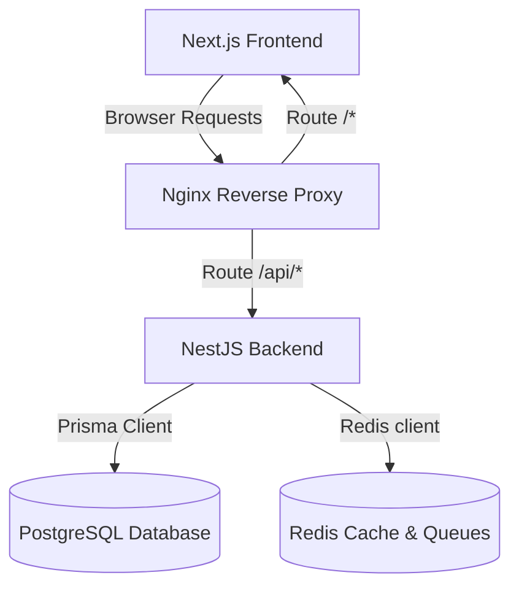

# Platform Architecture: DZCASH

This document details the software architecture, design patterns, and systemic breakdown of the DZCASH Get-Paid-To Rewards Platform.

---

## 🏗️ Architectural Overview

DZCASH uses a decoupled Client-Server architecture orchestrated via Docker Compose:

1. **Client (Next.js)**: Runs in the user's browser, communicating with the API. It leverages TailwindCSS for UI layouts, Lucide React for modern iconography, and React Query for asynchronous hook states.
2. **Gateway (Nginx)**: Directs reverse proxy endpoints, forwarding `/api/*` requests to the backend service and routing all other web elements to the frontend.
3. **Application Server (NestJS)**: Rest API handler managing JWT auth, user tracking, ledger ledgers, and fraud filters.
4. **Prisma ORM**: Interfaces with PostgreSQL, managing type-safety and migrations.
5. **PostgreSQL**: Serves as the primary ACID-compliant double-entry transactional store.
6. **Redis**: Cache storage and BullMQ async queuing system.

---

## 🧩 Key Design Patterns

### 1. Adapter Pattern (Offer Network Integration)
To enable modularity when adding new OfferWalls, we define a strict interface:
- [OfferProviderInterface](file:///c:/xampp/htdocs/dzcash/backend/src/offers/providers/offer-provider.interface.ts)

Individual networks like [CPX](file:///c:/xampp/htdocs/dzcash/backend/src/offers/providers/cpx.provider.ts) and [OfferToro](file:///c:/xampp/htdocs/dzcash/backend/src/offers/providers/offertoro.provider.ts) implement this interface to perform MD5/HMAC verification and parse conversions.

### 2. Double-Entry Ledger System
To guarantee financial integrity:
- Every balance shift (offer payout, cashout request, fraud reverse) is represented by an immutable [Transaction](file:///c:/xampp/htdocs/dzcash/backend/prisma/schema.prisma) row.
- Balance increments are performed using row locks inside PostgreSQL atomic transactions (`$transaction`) inside [WalletService](file:///c:/xampp/htdocs/dzcash/backend/src/wallet/wallet.service.ts).

### 3. Guard-Based Access Control
- Authentication routes are protected via [JwtAuthGuard](file:///c:/xampp/htdocs/dzcash/backend/src/auth/guards/jwt-auth.guard.ts).
- Administrator moderation paths are guarded by [AdminGuard](file:///c:/xampp/htdocs/dzcash/backend/src/admin/guards/admin.guard.ts), preventing unauthorized role modification.
